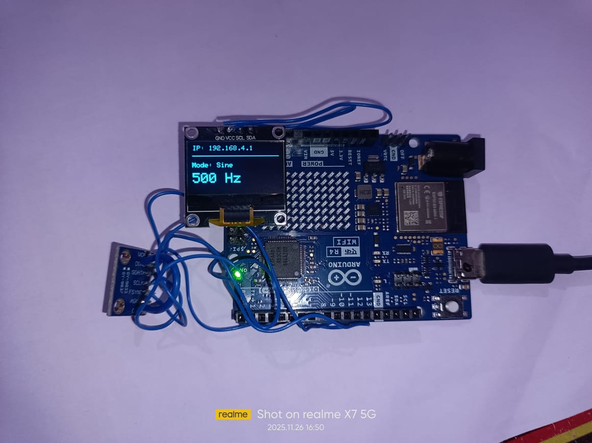
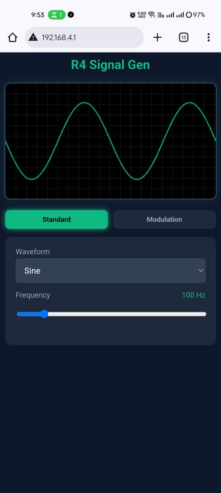
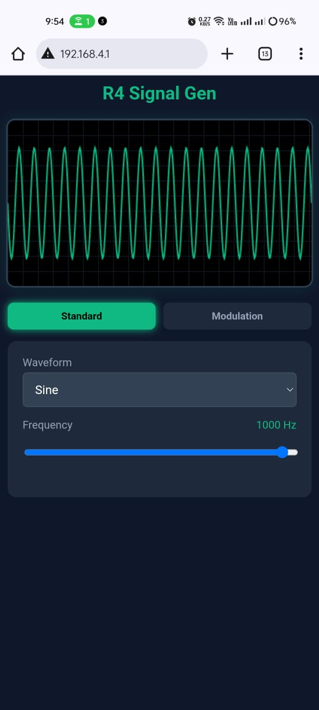
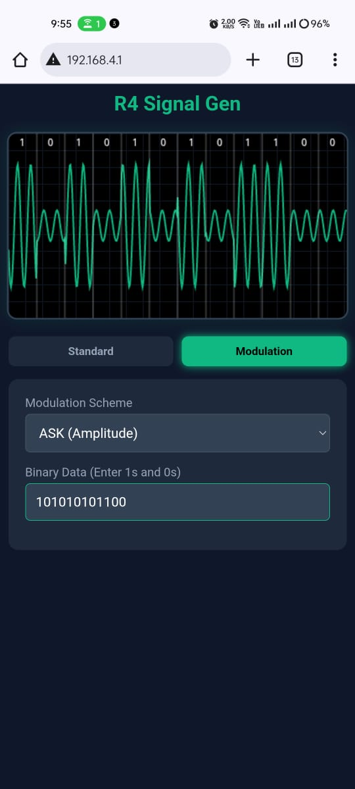
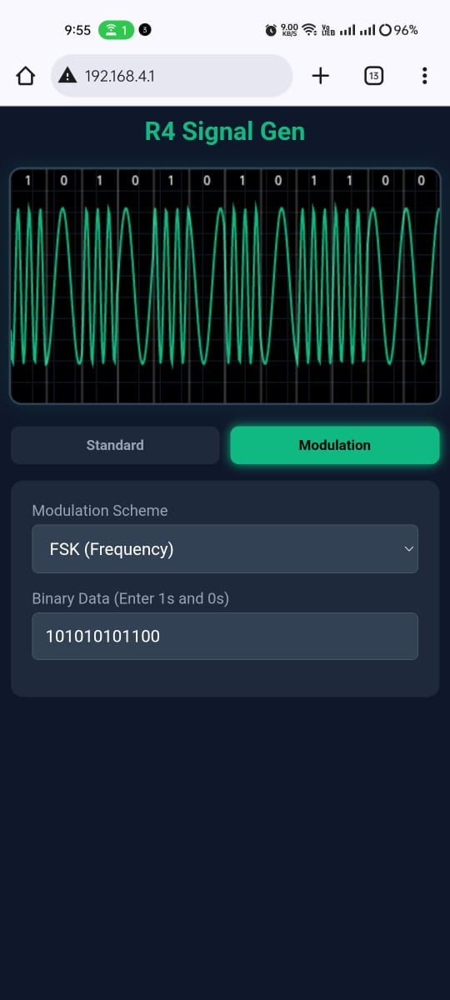
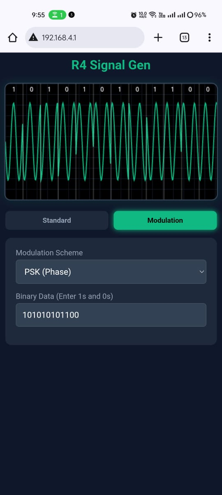

# -Function-Generator
Function Generator using Arduino R4 , AD9833 Module, OLED Display
# IoT Wireless Signal Generator (Arduino R4 WiFi + AD9833)

A compact, wireless function generator capable of producing Sine, Triangle, and Square waves. This project utilizes the **Arduino UNO R4 WiFi** to host a web server, allowing users to control frequency and waveforms remotely via a smartphone or PC. It relies on the **AD9833 DDS module** for precise signal synthesis and includes an **OLED display** for real-time status monitoring.

## 📖 Table of Contents
- [Features](#-features)
- [Hardware Required](#-hardware-required)
- [Circuit Diagram / Pinout](#-circuit-diagram--pinout)
- [Software & Libraries](#-software--libraries)
- [Web Interface & Screenshots](#-web-interface--screenshots)
- [Installation & Usage](#-installation--usage)

## 🚀 Features
- **Remote Control:** Host a WiFi Hotspot (AP Mode) to control the device via a web browser.
- **Waveforms:** Generates Sine, Triangle, and Square waves up to 12.5 MHz (hardware limit).
- **Modulation Simulation:** The Web UI visually simulates ASK (Amplitude Shift Keying), FSK (Frequency Shift Keying), and PSK (Phase Shift Keying).
- **OLED Feedback:** Displays current IP address, active waveform, and frequency on a 128x64 hardware screen.
- **Responsive UI:** Custom HTML/JS interface with a simulated oscilloscope built directly into the Arduino code.

## 🛠 Hardware Required
| Component | Description |
|-----------|-------------|
| **Arduino UNO R4 WiFi** | Main controller and Web Server host |
| **AD9833 Module** | Programmable DDS Waveform Generator |
| **0.96" OLED Display** | I2C, 128x64 resolution (SSD1306 driver) |
| **Jumper Wires** | For connections |
| **Breadboard** | For prototyping |

## 🔌 Circuit Diagram / Pinout

### AD9833 Connections (SPI)
| AD9833 Pin | Arduino R4 Pin |
|------------|----------------|
| **VCC** | 5V             |
| **GND** | GND            |
| **FSYNC** | D10            |
| **SCLK** | SCK (D13)      |
| **SDATA** | MOSI (D11)     |

### OLED Display Connections (I2C)
| OLED Pin | Arduino R4 Pin |
|----------|----------------|
| **VCC** | 5V             |
| **GND** | GND            |
| **SCL** | SCL            |
| **SDA** | SDA            |

### Hardware Setup
Below is the physical configuration of the project on a breadboard, showing the connections between the Arduino R4 WiFi, the AD9833 signal generator module, and the OLED display.

## 💻 Software & Libraries
To run this project, you need the **Arduino IDE** and the following libraries installed:

1.  **WiFiS3** (Standard library for Arduino R4 WiFi)
2.  **Adafruit GFX Library**
3.  **Adafruit SSD1306**

## 📱 Web Interface & Screenshots

The web interface is hosted directly on the Arduino. It provides a "Dark Mode" dashboard to toggle waveforms, adjust frequency via a slider, and visualize digital modulation.

### Standard Waveforms
| Sine Wave | Square Wave | Triangle Wave |
|:---:|:---:|:---:|
|  |  |  |

### Digital Modulation Schemes
*Note: The modulation below is visualized on the Web UI. The hardware outputs the carrier frequency when in modulation mode.*

| ASK (Amplitude Shift Keying) | FSK (Frequency Shift Keying) | PSK (Phase Shift Keying) |
|:---:|:---:|:---:|
|  |  |  |

## ⚙️ Installation & Usage

1.  **Wiring:** Connect the AD9833 and OLED display to the Arduino R4 according to the pinout above.
2.  **Library Setup:** Open Arduino IDE, go to `Tools` -> `Manage Libraries`, and install `Adafruit SSD1306` and `Adafruit GFX`.
3.  **Upload:** Connect your Arduino R4 WiFi via USB-C and upload the `.ino` file provided in this repository.
4.  **Connect:**
    * Open your phone/laptop WiFi settings.
    * Connect to the network: **`FuncGen_R4_Mod`**
    * Password: **`12345678`**
5.  **Control:**
    * Open a web browser and navigate to: **`http://192.168.4.1`**
    * Use the interface to generate signals!

## 📄 License
This project is open-source. Feel free to modify and distribute.
